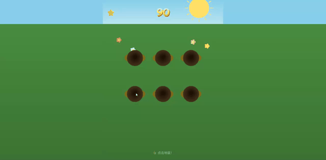

# MCTS Skill Demo

一个使用 MCTS-TD Planner 技能演示 MP4 转 GIF 在 GitHub README 中播放的项目。

## 演示



## 技术说明

- 原视频：`mini-game.mp4` (372KB, 1280×630, H.264, 14.26s)
- 转换后：`mini-game.gif` (640×315, 15fps, ~3MB)
- 转换工具：Python + imageio + PyAV + Pillow

## 转换脚本

```bash
python convert_to_gif.py
```

脚本使用 `imageio` 和 `pyav` 读取 MP4，用 `Pillow` 进行 LANCZOS 缩放和 GIF 编码，输出优化的循环 GIF。
